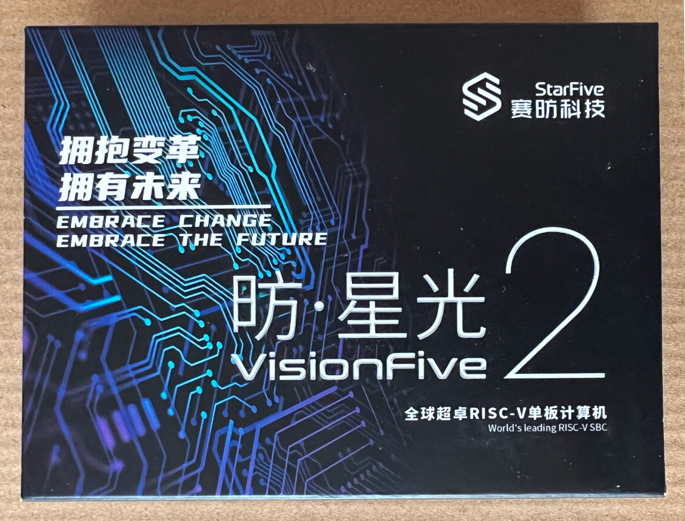
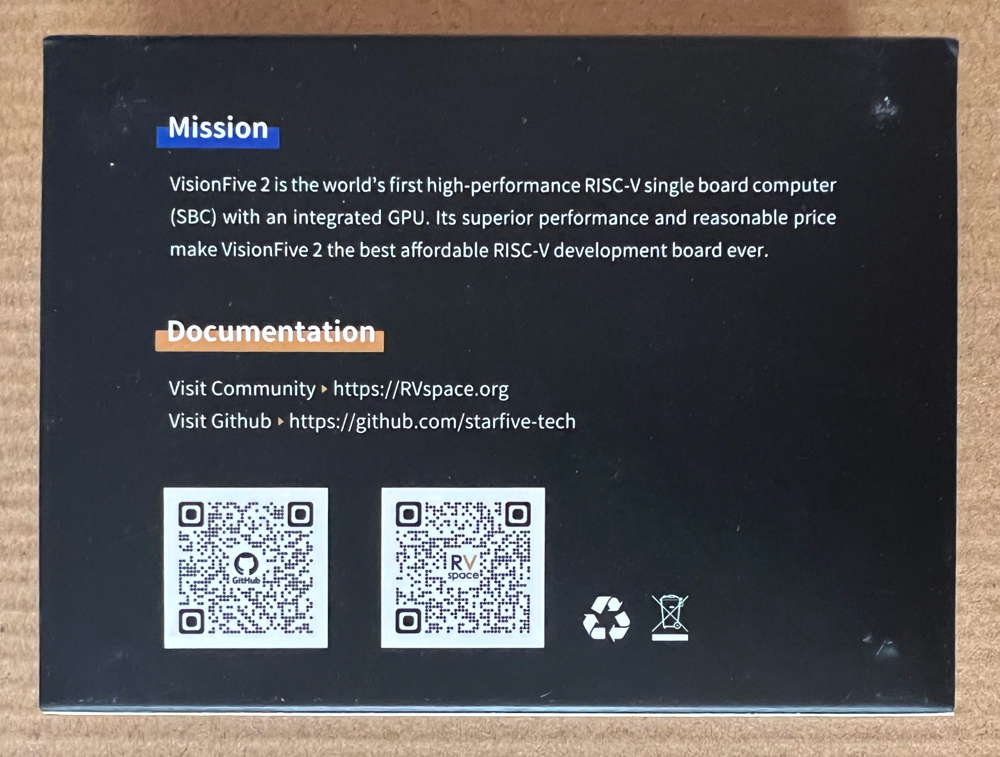
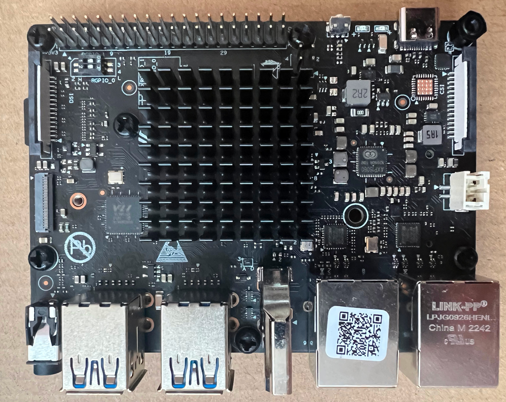
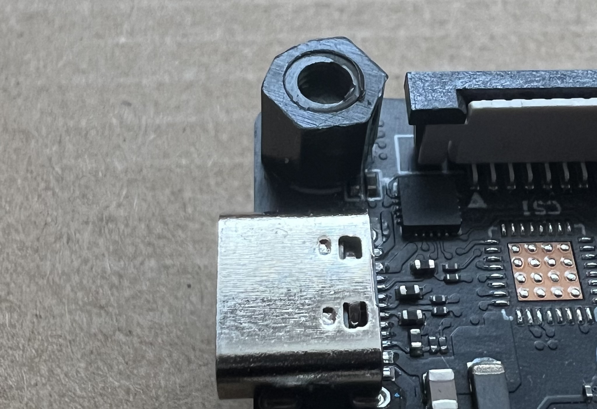
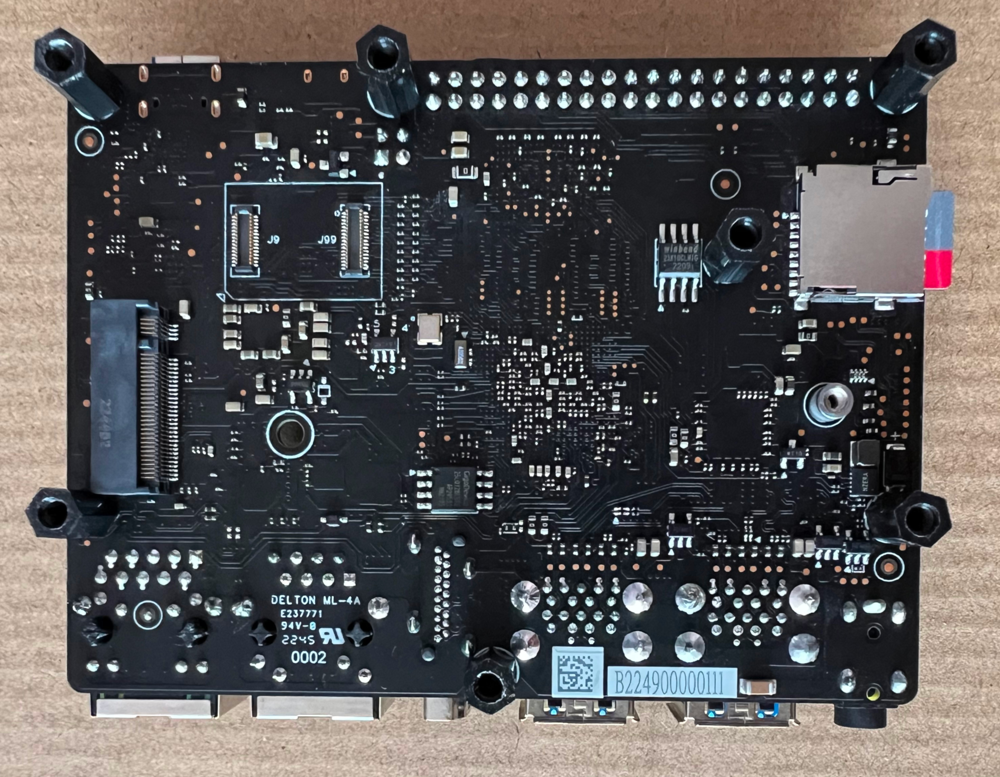
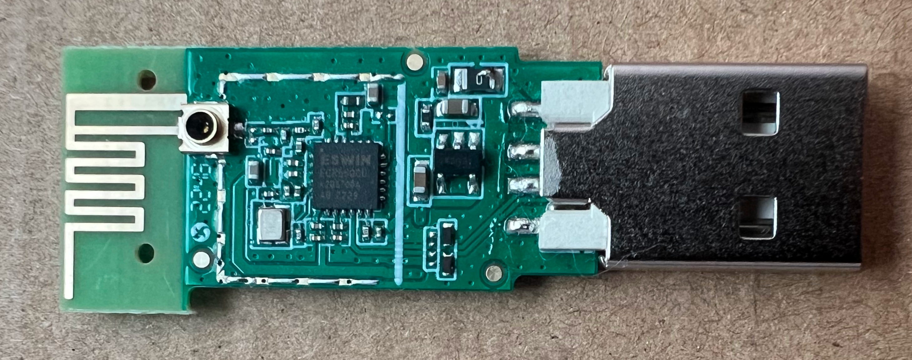

# Getting started

Package front:
 

Package back:
 

I've mounted spacers and 35x35x10mm radiator:
 

Placing components near mounting hole is definitely NOT a good solution, needed to cut a spacer:
 

PCB bottom:
 

I've ordered Vision Five 2 with WiFi dongle.
The chip on dongle is ESWIN ECR6600U. Looks like there is no drivers for this dongle so far.
 

I've tried both debian images that are available now:
- starfive-jh7110-VF2-VF2_515_v2.3.0-55.img
- starfive-jh7110-VF2_515_v2.5.0-69.img

I've used balenaEtcher to write image to microSD card.

Only starfive-jh7110-VF2-VF2_515_v2.3.0-55.img boot up, to use 69 I probably need to update U-boot.

For now it doesn't support 4k display. With 4k display it shows cursor and that's all.
And looks like for now SBC does not support SDXC cards, image written into 64 GB card has not boot up.

I've not managed to find/install drivers for WiFi dongle. I also don't have access to RJ45, only WiFi. The solution was to buy cheap router(TP-Link TL-WR841N) and use it in range extender mode.
In this mode RJ45 ports are also connected to internet.
